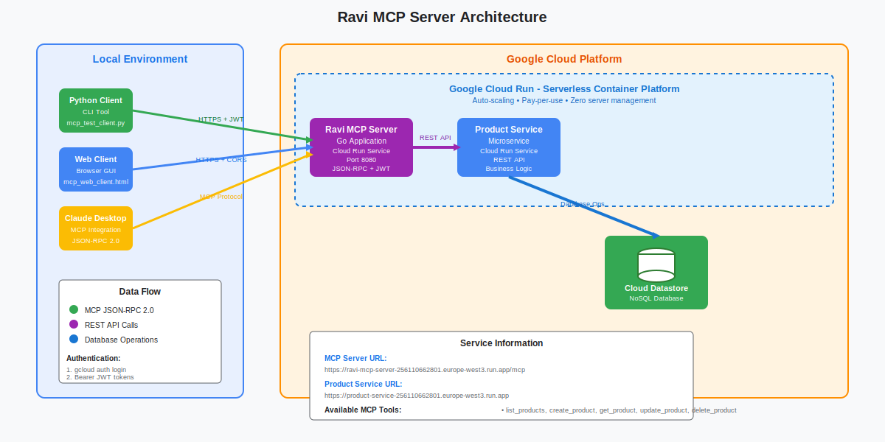

# Ravi MCP Server

A Model Context Protocol (MCP) server for product management via JSON-RPC 2.0.

**API Version:** v1.0.0

See [docs/api.md](docs/api.md) for a full API reference, including all methods, required parameters, and example payloads. If you change the API, increment the version and update the documentation.

## Overview

This project implements a MCP wrapper server using the Model Context Protocol (MCP) that allows AI agents to interact with a microservice called product service that provides the product data.

It provides tools for:

- Listing available products
- Creating, updating, and deleting products
- Bulk product operations
- Health check and welcome message

<details>
<summary>Architecture Diagram</summary>



</details>

## How to Run
<details>
1. **Clone the Project**  
   
Clone the repository and open it in VSCode.

   ```bash
   git clone <repository_url>
   cd <repository_name>
   code .
  ```
2. **Setup Configuration Files**
   Copy mcp.json and payload.json from docs/configuration to a new folder called .vscode in your repository.  
     mkdir .vscode
     cp docs/configuration/mcp.json .vscode/
     cp docs/configuration/payload.json .vscode/

3. Start the MCP Server 
      Start the ravi-mcp-server by running the server as described in the installation section.

4. Export GCP Authentication Token 
      Run the following command to export your GCP authentication token. 
      Ensure your account has the Cloud Run Invoker role (contact the repository owner if unsure). 

5. Test with GitHub Copilot Chat in Agent Mode 
      Open GitHub Copilot chat in agent mode and test with the following natural language commands:
           - show me all the available tools
           - Show all the products
           - List all products under Electronics category
           - Increment the price of all the products under Electronics category by 2%
           - Round up the price of all the products under Laptops segment to nearest 100
        The agent should automatically generate and execute the corresponding cURL requests in the background and display the results.

6. Note: If the agent asks you to run the cURL command, you can give below prompt:
   > Prompt: *Whenever I ask you about a tool in ravi-mcp-server, I want you to automatically generate and execute the corresponding cURL requests asynchronously in the background, actively displaying the results in plain text format, preferably structured as well-organized tables or lists for enhanced readability. No prior approval of individual cURL commands is necessary prior to execution.*
</details>

## Installation

<details>
<summary>Manual Installation</summary>

<b>Prerequisites</b>

- Go 1.23+
- Access to a product microservice (ask repo owner for MICROSERVICE_URL)

<b>Setup</b>
1. Clone this repository
2. Install dependencies:
  ```bash
  go mod download
  ```
3. Set environment variables:

**Note**: Contact repository owner for MICROSERVICE_URL and GCP authentication token.
  ```bash
  export MICROSERVICE_URL="<your_microservice_url>"
  export gcp_auth_token=$(gcloud auth print-identity-token)
  export PORT=8080
  ```
4. Run the server:
  ```bash
  go run main.go
  # or
  go run .
  ```
5. Test health endpoint:
  ```bash
  curl http://localhost:8080/health
  ```
6. Use `/mcp` endpoint for JSON-RPC requests (see `tests/test_commands.sh` for examples)

</details>


## Available Tools

- `list_products` — List all products
- `create_product` — Add a new product
- `get_product` — Get product details by ID
- `update_product` — Update product by ID
- `delete_product` — Delete product by ID
- `create_multiple_products` — Add multiple products
- `update_products` — Update multiple products
- `delete_products` — Delete multiple products
- `health_check` — Check server status
- `welcome_message` — Get welcome message


## Using Ravi MCP Server with GitHub Copilot Agent

<details>
<summary>Show details</summary>

To use this remote MCP server with GitHub Copilot agent mode (or any MCP-compatible client):

<b>1. Add <code>mcp.json</code> to your workspace (recommended location: <code>.vscode/mcp.json</code>)</b>

Example structure:
```json
{
  "servers": {
    "ravi-mcp-server": {
      "command": "curl",
      "args": [
        "-X", "POST",
        "https://ravi-mcp-server-256110662801.europe-west3.run.app/mcp",
        "-H", "Content-Type: application/json",
        "-H", "Authorization: Bearer {{GCP_AUTH_TOKEN}}",
        "-d", "@.vscode/payload.json"
      ]
    }
  }
}
```

<b>2. Authentication Token</b>

- You must provide a valid Google Cloud Bearer token for authentication.
- Recommended: Use `gcloud auth print-identity-token` to generate a token.
- Set the token in your environment or update the `mcp.json` as needed.

<b>3. Example Usage</b>

- With configuration in place, you can use natural language commands in Copilot agent mode, e.g.:
  - "List all products"
  - "Create a new product called 'iPhone 15' for $999"
  - "Update the price of product ID 123 to $899"
  - "Delete product ID 456"
  - "Show me the health status of the server"
  - "Fetch all products in the 'Electronics' category"
  - "Increase the price of all products by 5% in the 'Laptops' category"

<b>4. Sample payload.json</b>

Your `.vscode/payload.json` file is referenced in `mcp.json` and should contain a valid MCP JSON-RPC request. Example:

```json
{
  "jsonrpc": "2.0",
  "id": 1,
  "method": "tools/list"
}
```

You can modify this file to call any tool, e.g.:

```json
{
  "jsonrpc": "2.0",
  "id": 2,
  "method": "tools/call",
  "params": {
    "name": "list_products"
  }
}
```

<b>5. More Info</b>
- For team access setup, see [`docs/TEAM_ACCESS.md`](docs/TEAM_ACCESS.md).

</details>


## Troubleshooting

<details>
<summary>Show details</summary>

If you encounter issues:

1. Ensure your `MICROSERVICE_URL` is correct and accessible
2. Check Go version (should be 1.23+)
3. Review error messages in server logs

</details>

## Best Practices for Natural Language Querying

<details>
<summary>Show details</summary>

To smoothly query and see results in natural language, follow these steps before interacting with the MCP server:

1. **Export your GCP authentication token:**
  ```sh
   export gcp_auth_token=$(gcloud auth print-identity-token)
   (Make sure you get necessary roles assigned to your token, contact repo owner if unsure)
  ```

2. **Set the context for your agent (e.g., GitHub Copilot agent chat):**
  > Prompt: *Whenever I ask you about a tool in ravi-mcp-server, I want you to automatically generate and execute the corresponding cURL requests asynchronously in the background, actively displaying the results in plain text format, preferably structured as well-organized tables or lists for enhanced readability. No prior approval of individual cURL commands is necessary prior to execution.*


3. **Use natural language commands to query the MCP server. Example commands:**
  - show me all the available tools
  - Show all the products
  - List all products under Electronics category
  - Increment the price of all the products under Electronics category by 3%
  - Round up the price of all the products under Laptops segment to nearest 100

</details>