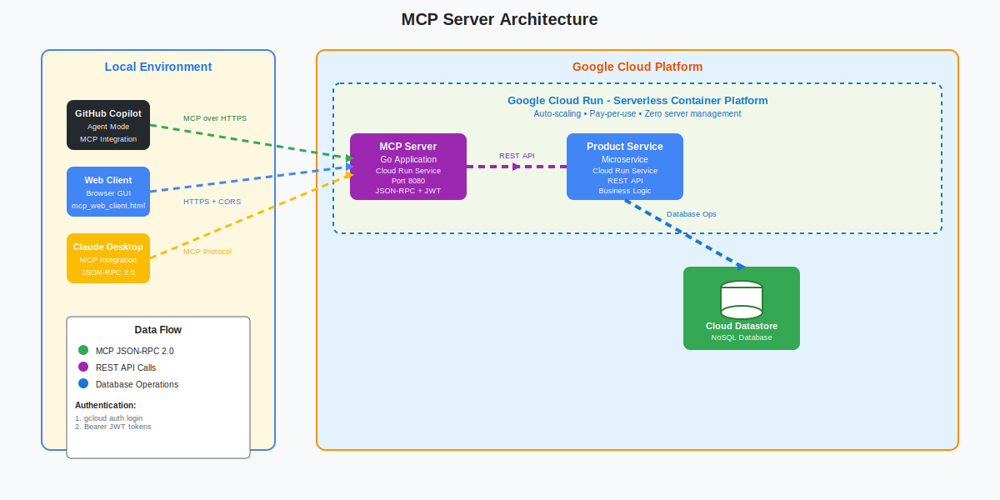

# MCP Server

A **Model Context <details>
<summary><strong>Fo<details>
<summary><strong>1. Get Access Token (After Ge<details>
<summa<details>
<summary><strong>Setup Go Environment</strong></summary>><strong>For New Contributors: Setup Requirements</strong></summary>

**Required Configuration:**g Access)</strong></summary>New Contributors: Get Access</strong></summary>

**Required for Testing:**ocol (MCP)** server that provides product management capabilities through a clean JSON-RPC 2.0 API. Deployed on Google Cloud Run with auto-scaling and high availability.

## **What is This?**

This server acts as a bridge between AI clients (like Claude Desktop) and a product database, enabling natural language interactions with structured data operations.

**Key Features:**
- MCP JSON-RPC 2.0 compliant
- Product CRUD operations 
- Google Cloud authentication
- Browser and CLI testing clients
- Microservices architecture

## **Architecture**

### **System Overview**

Choose your preferred visualization style:

**Modern Design** (Cloudflare-inspired)  


**Detailed View** (Technical documentation)  


**Flow:** MCP Clients → MCP Server → Product Service → Cloud Datastore

**Components:**
- **MCP Clients**: Python CLI, Web browser, Claude Desktop integration
- **MCP Server**: Go application handling JSON-RPC requests (Cloud Run)
- **Product Service**: Business logic microservice (Cloud Run) 
- **Cloud Datastore**: NoSQL database for product storage

## **Quick Test (2 minutes)**

<details>
<summary><strong>� For New Contributors: Get Access</strong></summary>

**🔐 Required for Testing:**
- **MICROSERVICE_URL**: Backend service endpoint
- **Google Cloud credentials**: Authentication token

**How to get access:**
1. **Contact Repository Owner**: Reach out to [@racho8](https://github.com/racho8) via:
   - GitHub Issues: [Create new issue](https://github.com/racho8/ravi-mcp-server/issues/new)
   - Email: (see GitHub profile)
   - Slack/Teams: (if you're on the same team)

2. **What to include in your request:**
   - Your GitHub username
   - Intended use case (testing, development, integration)
   - Google Cloud account email (for IAM permissions)

3. **What you'll receive:**
   - MICROSERVICE_URL endpoint
   - Google Cloud project access
   - Setup instructions specific to your use case

**For Team Members:** See [`docs/TEAM_ACCESS.md`](docs/TEAM_ACCESS.md) for detailed access setup.
</details>

<details>
<summary><strong>�🔑 1. Get Access Token (After Getting Access)</strong></summary>

```bash
# Authenticate with Google Cloud
gcloud auth login

# Get access token for API calls
gcloud auth print-access-token
```
</details>

<details>
<summary><strong>2. Choose Your Testing Method</strong></summary>

**Option A: Web Client (Easiest)**
```bash
cd mcp-clients
open mcp_web_client.html
# Paste your token and test in browser
```

**Option B: Python Client**
```bash
cd mcp-clients  
python mcp_test_client.py "list all products"
```

**Option C: Direct API Call**
```bash
# Replace <SERVER_URL> with the URL provided by repository owner
curl -H "Authorization: Bearer $(gcloud auth print-access-token)" \
  <SERVER_URL>/mcp \
  -d '{"jsonrpc":"2.0","id":1,"method":"tools/call","params":{"name":"health_check","arguments":{}}}'
```
</details>

## **Available Tools**

| Tool | Purpose | Example Usage |
|------|---------|---------------|
| `list_products` | Get all products | "show me all products" |
| `create_product` | Add new product | "create product: Laptop, Electronics, $999" |
| `get_product` | Get specific product | "get product with ID 123" |
| `update_product` | Modify product | "update product 123 price to $899" |
| `delete_product` | Remove product | "delete product 123" |
| `health_check` | Server status | "health check" |

## **Local Development**

<details>
<summary><strong>� For New Contributors: Setup Requirements</strong></summary>

**🔐 Required Configuration:**
- **MICROSERVICE_URL**: Backend service endpoint (contact repository owner)
- **Google Cloud credentials**: Project access for authentication

**To get started with local development:**
1. **Request access** from [@racho8](https://github.com/racho8) (see "Quick Test" section above)
2. **Follow the setup steps** below after receiving your configuration
3. **See [`SECURITY.md`](SECURITY.md)** for detailed security guidelines
</details>

<details>
<summary><strong>�🔧 Setup Go Environment</strong></summary>

```bash
# Quick setup (handles version issues)
./setup-go-env.sh

# Verify
go version  # Should be 1.23+
```
</details>

<details>
<summary><strong>Run Locally (After Getting Access)</strong></summary>

```bash
# Install dependencies
go mod download

# Run tests
go test -v ./...

# Set environment variables (replace with values provided by repository owner)
export MICROSERVICE_URL="<MICROSERVICE_URL_PROVIDED_BY_OWNER>"
export PORT="8080"

# Start server
go run main.go

# Test locally
curl http://localhost:8080/health
```

**Tip:** Create a `.env` file with your environment variables for convenience:
```bash
# .env (not committed to git)
MICROSERVICE_URL=<your_microservice_url>
PORT=8080
```
</details>

## **Integration**

<details>
<summary><strong>Claude Desktop (After Getting Access)</strong></summary>

```bash
# Copy MCP configuration template
cp config/mcp.json ~/.config/claude/claude_desktop_config.json

# Update the configuration file with:
# 1. Server URL provided by repository owner
# 2. Your authentication method (see SECURITY.md)

# Restart Claude Desktop, then ask: "Show me all products"
```

**Note:** You'll need to update the MCP configuration with the actual server URL provided by the repository owner.
</details>

<details>
<summary><strong>Custom Applications</strong></summary>

- **Endpoint**: Contact [@racho8](https://github.com/racho8) for server URL
- **Protocol**: MCP JSON-RPC 2.0
- **Auth**: Google Cloud Bearer tokens
- **Documentation**: See [`config/MCP_CONFIGURATION.md`](config/MCP_CONFIGURATION.md)
</details>

## **Project Structure**

```
ravi-mcp-server/
├── main.go                        # Core server
├── mcp-clients/                   # Testing clients
│   ├── mcp_test_client.py        # Python CLI
│   └── mcp_web_client.html       # Web GUI
├── config/                        # MCP configurations
├── docs/                          # Detailed guides
├── tests/                         # Complete testing suite
└── setup-go-env.sh               # Environment setup
```

## **Deployment & Management**

<details>
<summary><strong>Cloud Run Commands (For Authorized Users)</strong></summary>

```bash
# Update environment variables (replace with actual values)
gcloud run services update ravi-mcp-server \
    --region=europe-west3 \
    --set-env-vars "MICROSERVICE_URL=<MICROSERVICE_URL>"

# Check current environment variables
gcloud run services describe ravi-mcp-server \
  --region=europe-west3 \
  --format="value(spec.template.spec.containers[0].env)"

# Add IAM access for team members
gcloud run services add-iam-policy-binding ravi-mcp-server \
  --region=europe-west3 \
  --member="user:teammate@domain.com" \
  --role="roles/run.invoker"
```

**Note:** These commands require Google Cloud project access. Contact repository owner for permissions.
</details>

<details>
<summary><strong>Required Secrets (For Contributors with Deploy Access)</strong></summary>

For GitHub Actions deployment, these secrets must be configured:
- `GCP_SA_KEY`: Google Cloud service account key
- `GCP_PROJECT_ID`: Google Cloud project ID  
- `MICROSERVICE_URL`: Backend microservice endpoint
- `ALLOWED_ORIGIN`: CORS allowed origin

**Setup Guide:** See [`SECURITY.md`](SECURITY.md) for detailed instructions.
</details>

## **Need More Details?**

- **Security & Access**: [`SECURITY.md`](SECURITY.md) - Security guidelines and setup
- **Testing**: [`tests/README.md`](tests/README.md) - Comprehensive testing guide
- **Client Usage**: [`mcp-clients/README.md`](mcp-clients/README.md) - Complete client guide
- **Team Setup**: [`docs/TEAM_ACCESS.md`](docs/TEAM_ACCESS.md) - Team authentication
- **Configuration**: [`config/MCP_CONFIGURATION.md`](config/MCP_CONFIGURATION.md) - MCP setup

## **Getting Started as a New User**

**New to this repository?**
1. **Contact [@racho8](https://github.com/racho8)** for access credentials
2. **Read [`SECURITY.md`](SECURITY.md)** for security best practices  
3. **Start with the web client** for easiest testing experience
4. **Follow team setup guide** in [`docs/TEAM_ACCESS.md`](docs/TEAM_ACCESS.md)

**Already have access?** Jump to "Quick Test" section above!

---

**Ready to contribute?** All credentials and URLs are managed securely through environment variables and GitHub Secrets. Contact the repository owner for access!
